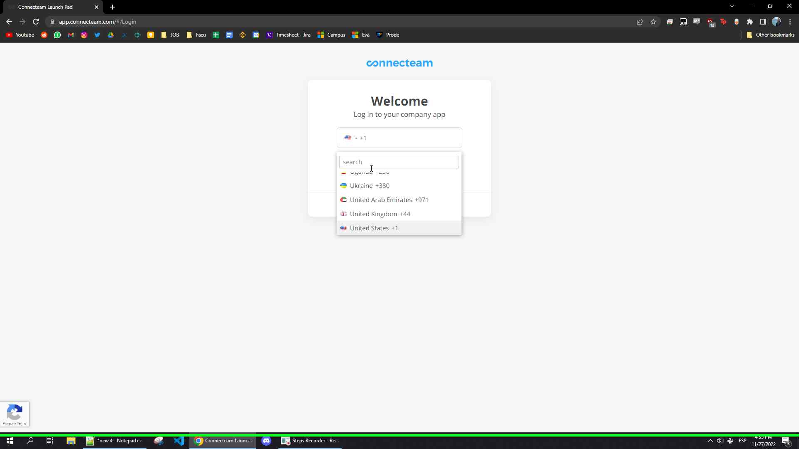

       Recorded Steps     <!-- /\* Font Definitions \*/ @font-face { font-family: Wingdings; panose-1: 5 0 0 0 0 0 0 0 0 0; mso-font-charset: 2; mso-generic-font-family: auto; mso-font-pitch: variable; mso-font-signature: 0 268435456 0 0 -2147483648 0; } @font-face { font-family: "Cambria Math"; panose-1: 2 4 5 3 5 4 6 3 2 4; mso-font-charset: 0; mso-generic-font-family: roman; mso-font-pitch: variable; mso-font-signature: 3 0 0 0 1 0; } @font-face { font-family: "Segoe UI"; panose-1: 2 11 5 2 4 2 4 2 2 3; mso-font-charset: 0; mso-generic-font-family: swiss; mso-font-pitch: variable; mso-font-signature: -469750017 -1073683329 9 0 511 0; } /\* Style Definitions \*/ p.MsoNormal, li.MsoNormal, div.MsoNormal { mso-style-unhide: no; mso-style-qformat: yes; mso-style-parent: ""; margin: 0in; mso-pagination: widow-orphan; font-size: 12.0pt; font-family: "Times New Roman", serif; mso-fareast-font-family: "Times New Roman"; mso-fareast-theme-font: minor-fareast; mso-believe-normal-left: yes; } h1 { mso-style-priority: 9; mso-style-unhide: no; mso-style-qformat: yes; mso-style-link: "Heading 1 Char"; margin-top: 5.25pt; margin-right: 0in; margin-bottom: 3.0pt; margin-left: 0in; mso-pagination: widow-orphan; mso-outline-level: 1; font-size: 13.0pt; font-family: "Times New Roman", serif; mso-fareast-font-family: "Times New Roman"; mso-fareast-theme-font: minor-fareast; color: #4465A2; font-weight: normal; } a:link, span.MsoHyperlink { mso-style-noshow: yes; mso-style-priority: 99; mso-ansi-font-size: 12.0pt; mso-bidi-font-size: 12.0pt; color: #1370AB; mso-text-animation: none; font-weight: normal; text-decoration: none; text-underline: none; text-decoration: none; text-line-through: none; } a:visited, span.MsoHyperlinkFollowed { mso-style-noshow: yes; mso-style-priority: 99; mso-ansi-font-size: 12.0pt; mso-bidi-font-size: 12.0pt; color: #1370AB; mso-text-animation: none; font-weight: normal; text-decoration: none; text-underline: none; text-decoration: none; text-line-through: none; } p { mso-style-priority: 99; margin-top: .75pt; margin-right: 0in; margin-bottom: .75pt; margin-left: 0in; mso-pagination: widow-orphan; font-size: 11.0pt; font-family: "Times New Roman", serif; mso-fareast-font-family: "Times New Roman"; mso-fareast-theme-font: minor-fareast; } span.Heading1Char { mso-style-name: "Heading 1 Char"; mso-style-priority: 9; mso-style-unhide: no; mso-style-locked: yes; mso-style-link: "Heading 1"; mso-ansi-font-size: 16.0pt; mso-bidi-font-size: 16.0pt; font-family: "Calibri Light", sans-serif; mso-ascii-font-family: "Calibri Light"; mso-ascii-theme-font: major-latin; mso-fareast-font-family: "Times New Roman"; mso-fareast-theme-font: major-fareast; mso-hansi-font-family: "Calibri Light"; mso-hansi-theme-font: major-latin; mso-bidi-font-family: "Times New Roman"; mso-bidi-theme-font: major-bidi; color: #2F5496; mso-themecolor: accent1; mso-themeshade: 191; } p.msonormal0, li.msonormal0, div.msonormal0 { mso-style-name: msonormal; mso-style-noshow: yes; mso-style-priority: 99; mso-style-unhide: no; margin-top: .75pt; margin-right: 0in; margin-bottom: .75pt; margin-left: 0in; mso-pagination: widow-orphan; font-size: 11.0pt; font-family: "Times New Roman", serif; mso-fareast-font-family: "Times New Roman"; mso-fareast-theme-font: minor-fareast; } p.left33, li.left33, div.left33 { mso-style-name: left33; mso-style-noshow: yes; mso-style-priority: 99; mso-style-unhide: no; mso-margin-top-alt: auto; margin-right: 0in; mso-margin-bottom-alt: auto; margin-left: 0in; mso-pagination: widow-orphan; font-size: 12.0pt; font-family: "Times New Roman", serif; mso-fareast-font-family: "Times New Roman"; mso-fareast-theme-font: minor-fareast; } p.align-left, li.align-left, div.align-left { mso-style-name: align-left; mso-style-noshow: yes; mso-style-priority: 99; mso-style-unhide: no; mso-margin-top-alt: auto; margin-right: 0in; mso-margin-bottom-alt: auto; margin-left: 0in; mso-pagination: widow-orphan; font-size: 12.0pt; font-family: "Times New Roman", serif; mso-fareast-font-family: "Times New Roman"; mso-fareast-theme-font: minor-fareast; } p.align-center, li.align-center, div.align-center { mso-style-name: align-center; mso-style-noshow: yes; mso-style-priority: 99; mso-style-unhide: no; mso-margin-top-alt: auto; margin-right: 0in; mso-margin-bottom-alt: auto; margin-left: 0in; text-align: center; mso-pagination: widow-orphan; font-size: 12.0pt; font-family: "Times New Roman", serif; mso-fareast-font-family: "Times New Roman"; mso-fareast-theme-font: minor-fareast; } p.align-right, li.align-right, div.align-right { mso-style-name: align-right; mso-style-noshow: yes; mso-style-priority: 99; mso-style-unhide: no; mso-margin-top-alt: auto; margin-right: 0in; mso-margin-bottom-alt: auto; margin-left: 0in; text-align: right; mso-pagination: widow-orphan; font-size: 12.0pt; font-family: "Times New Roman", serif; mso-fareast-font-family: "Times New Roman"; mso-fareast-theme-font: minor-fareast; } p.center-block, li.center-block, div.center-block { mso-style-name: center-block; mso-style-noshow: yes; mso-style-priority: 99; mso-style-unhide: no; mso-margin-top-alt: auto; margin-right: 0in; mso-margin-bottom-alt: auto; margin-left: 0in; mso-pagination: widow-orphan; font-size: 12.0pt; font-family: "Times New Roman", serif; mso-fareast-font-family: "Times New Roman"; mso-fareast-theme-font: minor-fareast; } span.accessible-text { mso-style-name: accessible-text; mso-style-unhide: no; } span.SpellE { mso-style-name: ""; mso-spl-e: yes; } span.GramE { mso-style-name: ""; mso-gram-e: yes; } .MsoChpDefault { mso-style-type: export-only; mso-default-props: yes; font-size: 10.0pt; mso-ansi-font-size: 10.0pt; mso-bidi-font-size: 10.0pt; } @page WordSection1 { size: 8.5in 11.0in; margin: 1.0in 1.0in 1.0in 1.0in; mso-header-margin: .5in; mso-footer-margin: .5in; mso-paper-source: 0; } div.WordSection1 { page: WordSection1; } /\* List Definitions \*/ @list l0 { mso-list-id: 557861162; mso-list-type: hybrid; mso-list-template-ids: 250936280 67698689 67698691 67698693 67698689 67698691 67698693 67698689 67698691 67698693; } @list l0:level1 { mso-level-number-format: bullet; mso-level-text: ; mso-level-tab-stop: none; mso-level-number-position: left; text-indent: -.25in; font-family: Symbol; } @list l0:level2 { mso-level-number-format: bullet; mso-level-text: o; mso-level-tab-stop: none; mso-level-number-position: left; text-indent: -.25in; font-family: "Courier New"; } @list l0:level3 { mso-level-number-format: bullet; mso-level-text: ; mso-level-tab-stop: none; mso-level-number-position: left; text-indent: -.25in; font-family: Wingdings; } @list l0:level4 { mso-level-number-format: bullet; mso-level-text: ; mso-level-tab-stop: none; mso-level-number-position: left; text-indent: -.25in; font-family: Symbol; } @list l0:level5 { mso-level-number-format: bullet; mso-level-text: o; mso-level-tab-stop: none; mso-level-number-position: left; text-indent: -.25in; font-family: "Courier New"; } @list l0:level6 { mso-level-number-format: bullet; mso-level-text: ; mso-level-tab-stop: none; mso-level-number-position: left; text-indent: -.25in; font-family: Wingdings; } @list l0:level7 { mso-level-number-format: bullet; mso-level-text: ; mso-level-tab-stop: none; mso-level-number-position: left; text-indent: -.25in; font-family: Symbol; } @list l0:level8 { mso-level-number-format: bullet; mso-level-text: o; mso-level-tab-stop: none; mso-level-number-position: left; text-indent: -.25in; font-family: "Courier New"; } @list l0:level9 { mso-level-number-format: bullet; mso-level-text: ; mso-level-tab-stop: none; mso-level-number-position: left; text-indent: -.25in; font-family: Wingdings; } ol { margin-bottom: 0in; } ul { margin-bottom: 0in; } --> p.MsoNormal { margin-left: 15.0pt; } function zoomToggle(num) { var img = document.getElementById("ss-" + num); if (img.className == "screenshot") { img.className = "screenshot-thumb"; } else { img.className = "screenshot"; } return false; }

Pasos
=====

El documento actual detallará los pasos para realizar la carga de horas mensuales en connecteam con el script que puede encontrar [aqui](https://github.com/Gasppo/script-connecteam/blob/master/script-connecteam.js).

Ante cualquier consulta pueden mandarme un mensaje a **gaspar.garciabarnetche@adilafinpay.com**

* * *

**Paso 1:**  Abrir Navegador

* * *

**Paso 2:** Ingresar a [_app.connecteam.com_](https://app.connecteam.com/)

* * *

**Paso 3:** Clickear en el selector de país y elegir Argentina

 

* * *

**Paso 4:** Ingresar su número de teléfono y apretar ‘Verify’

 

* * *

**Paso 5:** Ingresar codigo de verificación recibido por SMS

 

* * *

**Paso 6:** Usted debería encontrarse con el panel de inicio de Connecteam

 

* * *

**Paso 7:** Hacer click derecho luego “Inspect/Inspeccionar”

 

* * *

**Paso 8:** Hacer click en la pestaña de ‘Console/Consola’

 

* * *

**Paso 9:** Copiar el contenido del script (CTRL + C)

* * *

**Paso 10:** Pegar el contenido del script en la consola (CTRL+V) y luego dar enter para cargar el script en el navegador.

 

* * *

**Paso 11:** Ejecutar el script generateMontlyRequests con los siguientes 3 parametros:

- Project Name: Nombre del Proyecto al que se le asignaran las horas

- Year: Año de la carga

- Month: Mes de la carga (Numérico)

- Days Excluded: Arreglo de fechas que no se desean cargar, ejemplo como no quise cargar el feriado del 21 de noviembre incluí \[21\]. Los sábados y domingos se encuentran automáticamente excluidos. Este parámetro es opcional, si no se lo incluye solo se excluirán de la carga los sábados y domingos

* * *

**Paso 12:** Para verificar la carga correcta haga click en "View your requests (button)"

 

* * *

**Paso 13:** Y podrá confirmar la carga de las solicitudes

 

* * *

[Return to top of page...](#ReportTop "Return to top of page")